# Домашнее задание

### Шевцов А-13а-19

## **Задание 1**

**1.** $L = \{ w \in \{a, b, c\}^∗ : |w|_c = 1 \}$  

**Решение:**  

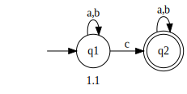

**2.** $L = \{ w \in \{ a, b \}^∗: |w|_a \leq 2, |w|_b \geq 2 \}$

**Решение:**  

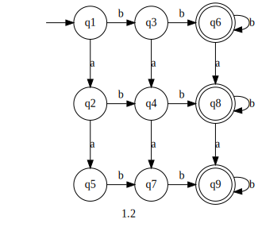

**3.**  $L = \{ w \in \{ a, b \}^∗: |w|_a \neq |w|_b \}$  

**Решение:**  

$\overline{L} = \{ w \in \{ a, b \}^∗: |w|_a = |w|_b \}$  
Фиксируем $\forall n \in \N, w = a^nb^n$  
$x = a^i$  
$y = a^j$  
$z = a^{n-i-j}b^n$  
$i \geq 0, j \gt 0, i+j \leq n$  
$\forall n \in \N \ \exist w \in \overline{L}: |w| \geq n, \forall xyz : x,y,z \in \Sigma^*, w=xyz, y \neq \lambda, |xy| \leq n\ \exist k = 2 : xy^kz \notin \overline{L}$   

Таким образом, по лемме о разрастании $\overline{L}$ не является регулярным (а следовательно и $L$), а это значит и ДКА не может быть построен.  

**4.**  $L = \{ w \in \{ a, b \}^∗: ww=www \}$  

**Решение:**  

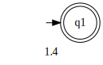

## **Задание 2**
**1.** $L_1 = \{ w \in \{a, b\}^∗ : |w|_a \geq 2\land|w|_b \geq 2 \}$  

**Решение:**  

**Первый Автомат**  
$L_q = \{ w \in \{a, b\}^∗ : |w|_a \geq 2\}$  
$Q_q = \{q_{1},q_{2},q_{3}\}$  
$T_q = \{q_{3}\}$  
  
$\delta_q$:  
|         |a        |b        |
|:-------:|:-------:|:-------:|
| $q_{1}$ | $q_{2}$ | $q_{1}$ |
| $q_{2}$ | $q_{3}$ | $q_{2}$ |
| $q_{3}$ | $q_{3}$ | $q_{3}$ |  

**Второй Автомат**  
$L_s = \{ w \in \{a, b\}^∗ : |w|_b \geq 2\}$  
$S_s = \{s_{1},s_{2},s_{3}\}$  
$T_s = \{s_{3}\}$  
  
$\delta_s$:  
|         |a        |b        |
|:-------:|:-------:|:-------:|
| $s_{1}$ | $s_{1}$ | $s_{2}$ |
| $s_{2}$ | $s_{2}$ | $s_{3}$ |
| $s_{3}$ | $s_{3}$ | $s_{3}$ |  

**Прямое произведение**  
$L = \{ w \in \{a, b\}^∗ : |w|_a \geq 2\land|w|_b \geq 2 \}$  
Пусть $f_{i|j} = \{q_i, s_j\}$  
$Q = \{f_{1|1},f_{1|2}, f_{1|3}, f_{2|1}, f_{2|2}, f_{2|3}, f_{3|1}, f_{3|2}, f_{3|3}\}$  
$T = \{f_{3|3}\}$  
  
$\delta$:  
|            |a           |b           |
|:----------:|:----------:|:----------:|
| $f_{1\|1}$ | $f_{2\|1}$ | $f_{1\|2}$ |
| $f_{1\|2}$ | $f_{2\|2}$ | $f_{1\|3}$ |
| $f_{1\|3}$ | $f_{2\|3}$ | $f_{1\|3}$ |
| $f_{2\|1}$ | $f_{3\|1}$ | $f_{2\|2}$ |
| $f_{2\|2}$ | $f_{3\|2}$ | $f_{2\|3}$ |
| $f_{2\|3}$ | $f_{3\|3}$ | $f_{2\|3}$ |
| $f_{3\|1}$ | $f_{3\|1}$ | $f_{3\|2}$ |
| $f_{3\|2}$ | $f_{3\|2}$ | $f_{3\|3}$ |
| $f_{3\|3}$ | $f_{3\|3}$ | $f_{3\|3}$ |  

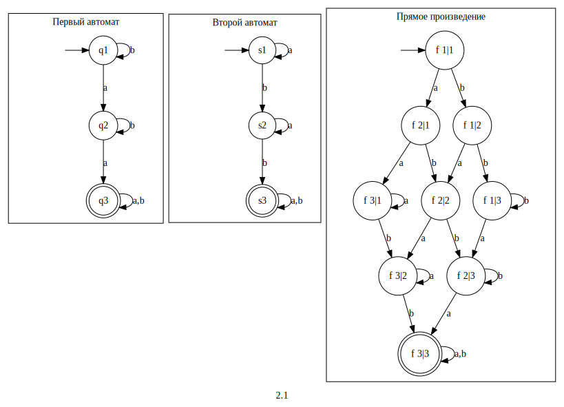

**2.** $L_2 = \{ w \in \{a, b, c\}^∗ : |w| \geq 3 \land |w|\ нечётное \}$  

**Решение:**  

**Первый Автомат**  
$L_q = \{ w \in \{a, b\}^∗ : |w| \geq 3\}$  
$Q_q = \{q_{1},q_{2},q_{3}, q_{4}\}$  
$T_q = \{q_{4}\}$  
  
$\delta_q$:  
|         |a        |b        |
|:-------:|:-------:|:-------:|
| $q_{1}$ | $q_{2}$ | $q_{2}$ |
| $q_{2}$ | $q_{3}$ | $q_{3}$ |
| $q_{3}$ | $q_{4}$ | $q_{4}$ |
| $q_{4}$ | $q_{4}$ | $q_{4}$ |  

**Второй Автомат**  
$L_s = \{ w \in \{a, b\}^∗ : |w|\ нечётное \}$  
$S_s = \{s_{1},s_{2}\}$  
$T_s = \{s_{2}\}$  
  
$\delta_s$:  
|         |a        |b        |
|:-------:|:-------:|:-------:|
| $s_{1}$ | $s_{2}$ | $s_{2}$ |
| $s_{2}$ | $s_{1}$ | $s_{1}$ |

**Прямое произведение**  
$L = \{ w \in \{a, b, c\}^∗ : |w| \geq 3 \land |w|\ нечётное \}$  
Пусть $f_{i|j} = \{q_i, s_j\}$  
$Q = \{f_{1|1},f_{1|2}, f_{2|1}, f_{2|2}, f_{3|1}, f_{3|2},  f_{4|1}, f_{4|2}\}$  
$T = \{f_{4|2}\}$  
  
$\delta$:  
|            |a           |b           |
|:----------:|:----------:|:----------:|
| $f_{1\|1}$ | $f_{2\|2}$ | $f_{2\|2}$ |
| $f_{1\|2}$ | $f_{2\|1}$ | $f_{2\|1}$ |
| $f_{2\|1}$ | $f_{3\|2}$ | $f_{3\|2}$ |
| $f_{2\|2}$ | $f_{3\|1}$ | $f_{3\|1}$ |
| $f_{3\|1}$ | $f_{4\|2}$ | $f_{4\|2}$ |
| $f_{3\|2}$ | $f_{4\|1}$ | $f_{4\|1}$ |
| $f_{4\|1}$ | $f_{4\|2}$ | $f_{4\|2}$ |
| $f_{4\|2}$ | $f_{4\|1}$ | $f_{4\|1}$ |

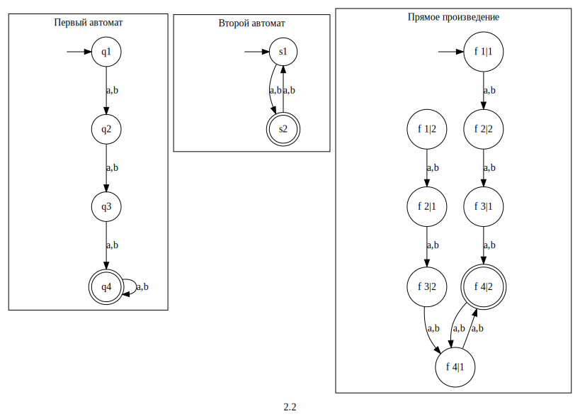

**3.** $L_3 = \{ w \in \{a, b\}^∗ : |w|_a\ чётно \land |w|_b\ кратно\ трём \}$  

**Решение:**  

**Первый Автомат**  
$L_q = \{ w \in \{a, b\}^∗ : |w|_a\ чётно\}$  
$Q_q = \{q_{1},q_{2}\}$  
$T_q = \{q_{1}\}$  
  
$\delta_q$:  
|         |a        |b        |
|:-------:|:-------:|:-------:|
| $q_{1}$ | $q_{2}$ | $q_{1}$ |
| $q_{2}$ | $q_{1}$ | $q_{2}$ |

**Второй Автомат**  
$L_s = \{ w \in \{a, b\}^∗ :|w|_b\ кратно\ трём \}$  
$S_s = \{s_{1},s_{2},s_{3}\}$  
$T_s = \{s_{1}\}$  
  
$\delta_s$:  
|         |a        |b        |
|:-------:|:-------:|:-------:|
| $s_{1}$ | $s_{1}$ | $s_{2}$ |
| $s_{2}$ | $s_{2}$ | $s_{3}$ |
| $s_{3}$ | $s_{3}$ | $s_{1}$ |  

**Прямое произведение**  
$L  = \{ w \in \{a, b\}^∗ : |w|_a\ чётно \land |w|_b\ кратно\ трём \}$  
Пусть $f_{i|j} = \{q_i, s_j\}$  
$Q = \{f_{1|1},f_{1|2}, f_{1|3}, f_{2|1}, f_{2|2}, f_{2|3}\}$  
$T = \{f_{1|1}\}$  
  
$\delta$:  
|            |a           |b           |
|:----------:|:----------:|:----------:|
| $f_{1\|1}$ | $f_{2\|1}$ | $f_{1\|2}$ |
| $f_{1\|2}$ | $f_{2\|2}$ | $f_{1\|3}$ |
| $f_{1\|3}$ | $f_{2\|3}$ | $f_{1\|1}$ |
| $f_{2\|1}$ | $f_{1\|1}$ | $f_{2\|2}$ |
| $f_{2\|2}$ | $f_{1\|2}$ | $f_{2\|3}$ |
| $f_{2\|3}$ | $f_{1\|3}$ | $f_{2\|1}$ |

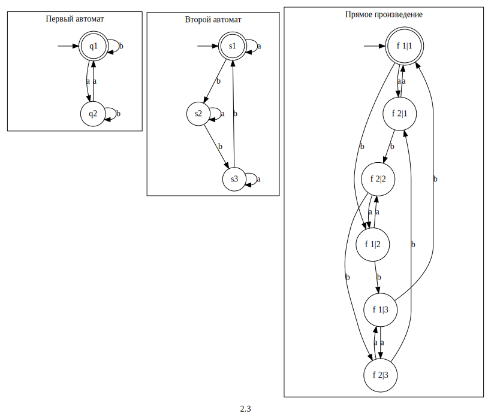

**4.** $L_4 = \overline{L_3}$  

**Решение:**  
Возьмём автомат $L_3$, построенный по произведению и по определению дополнения перестроим его: $L_3 = \{\Sigma, Q, S, T, \delta\}$, а $\overline{L_3} = \{\Sigma, Q,S,T_1 = Q \backslash T, \delta\}$  
 
$Q = \{f_{1|1},f_{1|2}, f_{1|3}, f_{2|1}, f_{2|2}, f_{2|3}\}$  
$T = \{f_{1|1}\}$  
$T_1 = \{f_{1|2}, f_{1|3}, f_{2|1}, f_{2|2}, f_{2|3}\}$

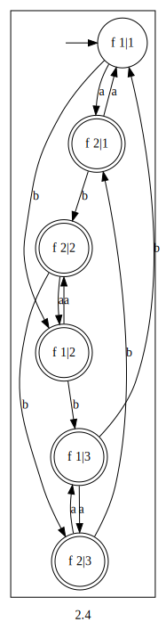

**5.** $L_4 = L_2 \backslash L_3$  
**Решение:**  
По определению разности: $L_4 = L_2 \cap \overline{L_3}$  

**Первый Автомат**  
$L_q = \{ w \in \{a, b, c\}^∗ : |w| \geq 3 \land |w|\ нечётное \}$  
$Q_q = \{q_1,q_2, q_3, q_4, q_5, q_6,  q_7, q_8\}$  
$T_q = \{q_8\}$  
  
$\delta_q$:  
|       |a      |b      |
|:-----:|:-----:|------:|
| $q_1$ | $q_4$ | $q_4$ |
| $q_2$ | $q_3$ | $q_3$ |
| $q_3$ | $q_6$ | $q_6$ |
| $q_4$ | $q_5$ | $q_5$ |
| $q_5$ | $q_8$ | $q_8$ |
| $q_6$ | $q_7$ | $q_7$ |
| $q_7$ | $q_8$ | $q_8$ |
| $q_8$ | $q_7$ | $q_7$ |

**Второй Автомат**  
$L_s  = \overline{L}_3$  
$L_3 = \{ w \in \{a, b\}^∗ : |w|_a\ чётно \land |w|_b\ кратно\ трём \}$  
$Q_s = \{s_{1 },s_{2 }, s_{3 }, s_{4 }, s_{5 }, s_{6 }\}$  
$T_s = \{s_{2 }, s_{3 }, s_{4 }, s_{5 }, s_{6 }\}$  
  
$\delta_s$:  
|          |a         |b         |
|:--------:|:--------:|:--------:|
| $s_{1 }$ | $s_{4 }$ | $s_{2 }$ |
| $s_{2 }$ | $s_{5 }$ | $s_{3 }$ |
| $s_{3 }$ | $s_{6 }$ | $s_{1 }$ |
| $s_{4 }$ | $s_{1 }$ | $s_{5 }$ |
| $s_{5 }$ | $s_{2 }$ | $s_{6 }$ |
| $s_{6 }$ | $s_{3 }$ | $s_{4 }$ |

**Прямое произведение**  
$L = L_2 \cap \overline{L_3}$  
Пусть $f_{i|j} = \{q_i, s_j\}$  
$Q =$
{
    $f_{1|1}$,
    $f_{1|2}$,
    $f_{1|3}$,
    $f_{1|4}$,
    $f_{1|5}$,
    $f_{1|6}$,
    $f_{2|1}$,
    $f_{2|2}$,
    $f_{2|3}$,
    $f_{2|4}$,
    $f_{2|5}$,
    $f_{2|6}$,
    $f_{3|1}$,
    $f_{3|2}$,
    $f_{3|3}$,
    $f_{3|4}$,
    $f_{3|5}$,
    $f_{3|6}$,
    $f_{4|1}$,
    $f_{4|2}$,
    $f_{4|3}$,
    $f_{4|4}$,
    $f_{4|5}$,
    $f_{4|6}$,
    $f_{5|1}$,
    $f_{5|2}$,
    $f_{5|3}$,
    $f_{5|4}$,
    $f_{5|5}$,
    $f_{5|6}$,
    $f_{6|1}$,
    $f_{6|2}$,
    $f_{6|3}$,
    $f_{6|4}$,
    $f_{6|5}$,
    $f_{6|6}$,
    $f_{7|1}$,
    $f_{7|2}$,
    $f_{7|3}$,
    $f_{7|4}$,
    $f_{7|5}$,
    $f_{7|6}$,
    $f_{8|1}$,
    $f_{8|2}$,
    $f_{8|3}$,
    $f_{8|4}$,
    $f_{8|5}$,
    $f_{8|6}$ 
}

$T = \{f_{8|2}, f_{8|3}, f_{8|4}, f_{8|5}, f_{8|6}\}$  
  
$\delta$:  
|             |a           |b           |
|:-----------:|:----------:|:----------:|
| $f_{1\|1}$  | $f_{4\|4}$ | $f_{4\|2}$ |
| $f_{1\|2}$  | $f_{4\|5}$ | $f_{4\|3}$ |
| $f_{1\|3}$  | $f_{4\|6}$ | $f_{4\|1}$ |
| $f_{1\|4}$  | $f_{4\|1}$ | $f_{4\|5}$ |
| $f_{1\|5}$  | $f_{4\|2}$ | $f_{4\|6}$ |
| $f_{1\|6}$  | $f_{4\|3}$ | $f_{4\|4}$ |
| $f_{2\|1}$  | $f_{3\|4}$ | $f_{3\|2}$ |
| $f_{2\|2}$  | $f_{3\|5}$ | $f_{3\|3}$ |
| $f_{2\|3}$  | $f_{3\|6}$ | $f_{3\|1}$ |
| $f_{2\|4}$  | $f_{3\|1}$ | $f_{3\|5}$ |
| $f_{2\|5}$  | $f_{3\|2}$ | $f_{3\|6}$ |
| $f_{2\|6}$  | $f_{3\|3}$ | $f_{3\|4}$ |
| $f_{3\|1}$  | $f_{6\|4}$ | $f_{6\|2}$ |
| $f_{3\|2}$  | $f_{6\|5}$ | $f_{6\|3}$ |
| $f_{3\|3}$  | $f_{6\|6}$ | $f_{6\|1}$ |
| $f_{3\|4}$  | $f_{6\|1}$ | $f_{6\|5}$ |
| $f_{3\|5}$  | $f_{6\|2}$ | $f_{6\|6}$ |
| $f_{3\|6}$  | $f_{6\|3}$ | $f_{6\|4}$ |
| $f_{4\|1}$  | $f_{5\|4}$ | $f_{5\|2}$ |
| $f_{4\|2}$  | $f_{5\|5}$ | $f_{5\|3}$ |
| $f_{4\|3}$  | $f_{5\|6}$ | $f_{5\|1}$ |
| $f_{4\|4}$  | $f_{5\|1}$ | $f_{5\|5}$ |
| $f_{4\|5}$  | $f_{5\|2}$ | $f_{5\|6}$ |
| $f_{4\|6}$  | $f_{5\|3}$ | $f_{5\|4}$ |
| $f_{5\|1}$  | $f_{8\|4}$ | $f_{8\|2}$ |
| $f_{5\|2}$  | $f_{8\|5}$ | $f_{8\|3}$ |
| $f_{5\|3}$  | $f_{8\|6}$ | $f_{8\|1}$ |
| $f_{5\|4}$  | $f_{8\|1}$ | $f_{8\|5}$ |
| $f_{5\|5}$  | $f_{8\|2}$ | $f_{8\|6}$ |
| $f_{5\|6}$  | $f_{8\|3}$ | $f_{8\|4}$ |
| $f_{6\|1}$  | $f_{7\|4}$ | $f_{7\|2}$ |
| $f_{6\|2}$  | $f_{7\|5}$ | $f_{7\|3}$ |
| $f_{6\|3}$  | $f_{7\|6}$ | $f_{7\|1}$ |
| $f_{6\|4}$  | $f_{7\|1}$ | $f_{7\|5}$ |
| $f_{6\|5}$  | $f_{7\|2}$ | $f_{7\|6}$ |
| $f_{6\|6}$  | $f_{7\|3}$ | $f_{7\|4}$ |
| $f_{7\|1}$  | $f_{8\|4}$ | $f_{8\|2}$ |
| $f_{7\|2}$  | $f_{8\|5}$ | $f_{8\|3}$ |
| $f_{7\|3}$  | $f_{8\|6}$ | $f_{8\|1}$ |
| $f_{7\|4}$  | $f_{8\|1}$ | $f_{8\|5}$ |
| $f_{7\|5}$  | $f_{8\|2}$ | $f_{8\|6}$ |
| $f_{7\|6}$  | $f_{8\|3}$ | $f_{8\|4}$ |
| $f_{8\|1}$  | $f_{7\|4}$ | $f_{7\|2}$ |
| $f_{8\|2}$  | $f_{7\|5}$ | $f_{7\|3}$ |
| $f_{8\|3}$  | $f_{7\|6}$ | $f_{7\|1}$ |
| $f_{8\|4}$  | $f_{7\|1}$ | $f_{7\|5}$ |
| $f_{8\|5}$  | $f_{7\|2}$ | $f_{7\|6}$ |
| $f_{8\|6}$  | $f_{7\|3}$ | $f_{7\|4}$ |  

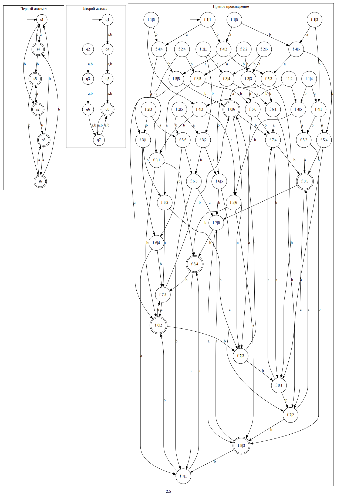

## **Задание 3**
**1.** $(ab+aba)^*a$  
**Решение:**  
Построим НКА с $\lambda$ по регулярному выражению, удалим $\lambda$, получив НКА, детерминируем его. Получили ДКА, уже является минимальным.  

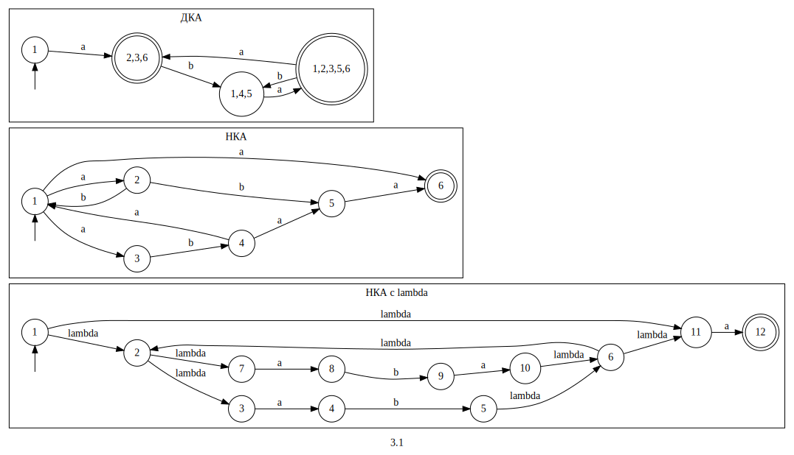

**2.** $a(a(ab)^*b)^*(ab)^*$  
**Решение:**  
Построим НКА с $\lambda$ по регулярному выражению, удалим $\lambda$, получив НКА, детерминируем его. Получили ДКА, уже является минимальным.  

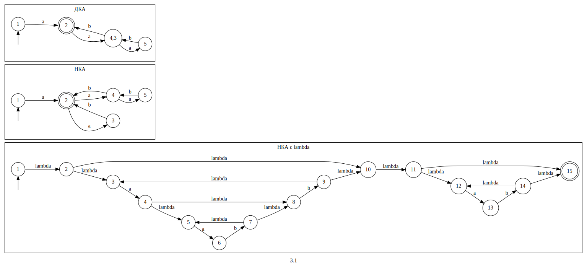

## **Задание 4**
**1.** $L = \{(aab)^nb(aba)^m : n \geq 0, m \geq 0\}$  
Регулярный. Автомат:  
  
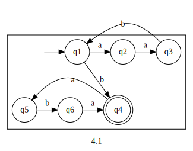

**2.** $L = \{uaav : u \in \{a,b\}^*, v \in \{a,b\}^*, |u|_b \geq |v|_a\}$  
**Решение:**  
$\overline{L} = \{uaav : u \in \{a,b\}^*, v \in \{a,b\}^*, |u|_b \lt |v|_a\}$  
Фиксируем $\forall n \in \N , w = b^naaa^{n+1}$  
$x = b^i$  
$y = b^j$  
$z = b^{n-i-j}aab^{n+1}$  
$i \geq 0, j \gt 0, i+j \leq n$  
$\forall n \in \N \ \exist w \in \overline{L}: |w| \geq n, \forall xyz : x,y,z \in \Sigma^*, w=xyz, y \neq \lambda, |xy| \leq n\ \exist k = 2 : xy^kz \notin \overline{L}$  

Таким образом, по лемме о разрастании $\overline{L}$ не является регулярным (а следовательно и $L$).

**3.** $L = \{a^mw : w \in \{a,b\}^*, 1 \leq |w|_b \leq m \}$  
**Решение:**  
Фиксируем $\forall n \in \N , w = a^nb^n$  
$x = a^i$  
$y = a^j$  
$z = a^{n-i-j}b^{n}$  
$i \geq 0, j \gt 0, i+j \leq n$  
$\forall n \in \N \ \exist w \in L: |w| \geq n, \forall xyz : x,y,z \in \Sigma^*, w=xyz, y \neq \lambda, |xy| \leq n\ \exist k = 0 : xy^kz \notin L$  

Таким образом, по лемме о разрастании $L$ не является регулярным.

**4.** $L = \{a^kb^ma^n : k=n \lor m > 0\}$  
**Решение:**  
Фиксируем $\forall n \in \N , w = a^nba^n$  
$x = a^i$  
$y = a^j$  
$z = a^{n-i-j}ba^{n}$  
$i \geq 0, j \gt 0, i+j \leq n$  
$\forall n \in \N \ \exist w \in L: |w| \geq n, \forall xyz : x,y,z \in \Sigma^*, w=xyz, y \neq \lambda, |xy| \leq n\ \exist k = 2 : xy^kz \notin L$  

Таким образом, по лемме о разрастании $L$ не является регулярным.

**5.** $L = \{ucv : u \in \{a,b\}^*, v \in \{a,b\}^*, u \neq v^R\}$  
**Решение:**  
$\overline{L} = \{ucv : u \in \{a,b\}^*, v \in \{a,b\}^*, u = v^R\}$  
Фиксируем $\forall n \in \N , w = a^nca^n$  
$x = a^i$  
$y = a^j$  
$z = a^{n-i-j}ca^{n}$  
$i \geq 0, j \gt 0, i+j \leq n$  
$\forall n \in \N \ \exist w \in \overline{L}: |w| \geq n, \forall xyz : x,y,z \in \Sigma^*, w=xyz, y \neq \lambda, |xy| \leq n\ \exist k = 2 : xy^kz \notin \overline{L}$  

Таким образом, по лемме о разрастании $\overline{L}$ не является регулярным (а следовательно и $L$).

## **Задание 5**

**2.** Прямое произведение языков, с возможностью построить пересечение,
объединение и разность  
**Решение:**  
Программа на **C++** с использованием **Graphviz**, лежит в  `./5/regular_langs/` (проект для **Visual Studio**)

Скомпилированная программа лежит в папке `./5/regular_langs/copiled_program/`.  
  
`program.exe` - консольное приложение, при запуске 1,2 аргументы - пути к файлам с входными языками в виде дка, 3 - имя выходного файла (markdown), 4,5 - необязательные, задают разность (-d) и объединение (-i)
  
Результат работы программы - файл с изображениями автоматов на markdown, сами изображения - в папке `output_data`.  

`start.bat` - пакетный файл, запускающий программу с аргументами `1.txt` `2.txt` `out.md` `-d` `-i` (для примера работы программы)

### Формат входных файлов  
На 1 строке - `символы алфавита`  
Далее, до пустой строки - имя вершины, по которой идёт переход по iму символу алфавита или пусто, если нет перехода). Обозначим через $\delta(q_i, \Sigma_i)$  
$q_0$` | ` $\delta(q_0, \Sigma_1)$` | `$\delta(q_0, \Sigma_2)$ `..  `  
...  
$q_n$` | ` $\delta(q_n, \Sigma_1)$` | `$\delta(q_n, \Sigma_2)$ `..  `  
Далее - терминальные вершины, по 1 в строке, до пустой строки  
$q_{t_1}$  
..  
$q_{t_k}$  
Последняя строка - начальная вершина  
$q_{s}$  